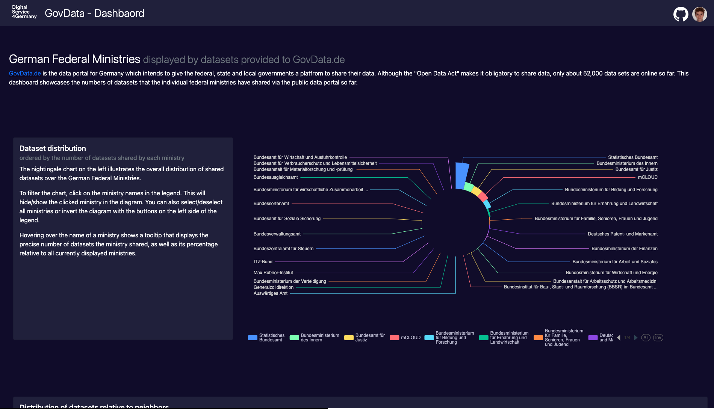

# GovDataDashboard

This GovData Dashboard is based on GovData.de and is part of my application for the Tech4Germany Engineering Fellowship.

To run this application you need to have node and npm installed. To run this application you need to have node and npm installed. To build/run this website please move to the root directory in your commandline and install the projects dependencies with `npm install`.

The project was generated with [Angular CLI](https://github.com/angular/angular-cli) version 13.3.0.

## Development server

Run `ng serve` for a dev server. Navigate to `http://localhost:4200/`. The application will automatically reload if you change any of the source files.

## Build

Run `ng build` to build the project. The build artifacts will be stored in the `dist/` directory.

## Running unit tests
The application is only partially tested due to the time constraints on this prototype. To illustrate my ability to test my code, have a look at the DataService, which is exemplarily tested. 

Further testing would include e2e testing with [cypress](https://www.cypress.io/).

Run `ng test` to execute the unit tests via [Karma](https://karma-runner.github.io).

## API calls
The Api has been mocked with the provided data. The DataService is fully functional with an external API and simply ingests the mock data in the assets folder instead of calling an api. 

## Project Structure
### theme: 
The theme module implements part of the app shell pattern. It contains all components that are relevant for static purposes such as layouts and components that are frequently reused in the entire UI.

As we don't need layouts for this simple demo, the lyout directory has been ommited. 

The components directory hosts all components that can be used in different layouts or that can be generically reused in the entire app.

### core:
The core module implements everything that has to do with transformation logic, models, guards and external communication via services.

Transformation logic refers to all sorts of pipes and filters that can be reused throughout the UI, so basically logic components that are not tied to a UI element. The object design of the UI is reflected in the classes of the models directory.

All route guards, that for example ensure that only authenticated users can access certain pages are located in the guards directory. (This demo dosent use any route guards so the directory is ommited) 

The applications services that house all API communication logic (in this demo the DataService) or application support communication logic (e.g. between a sidebar and a header button to collapse the sidebar) are located in the services directory. 

### content:
The content module hosts the dynamic views of the application and is responsible for correct routing. Here you can find all pages that belong to the website. It also hosts a pre-made component for invalid routes (not-found-component).